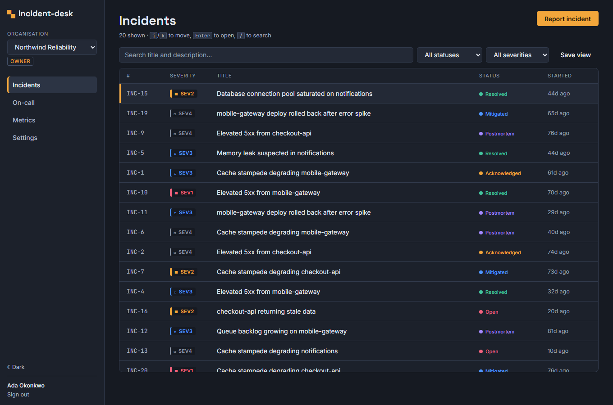
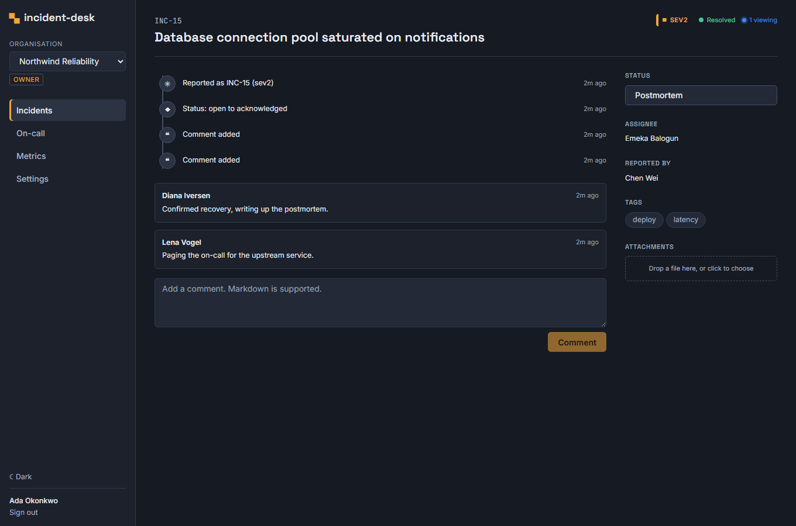
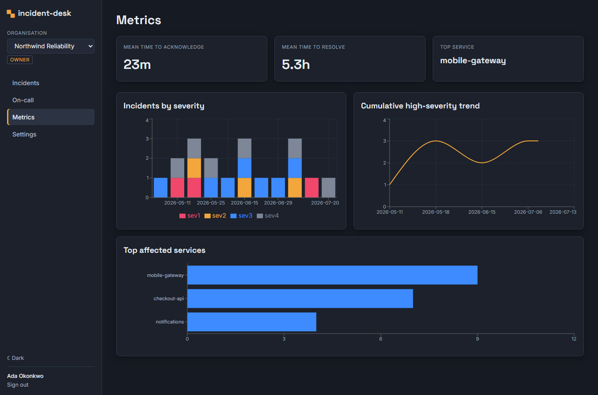
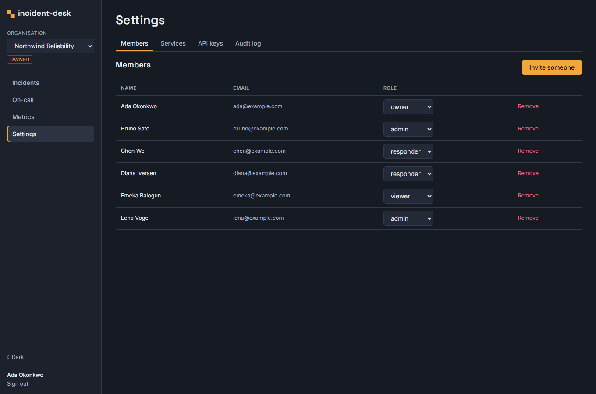

# incident-desk

[](https://github.com/akriti-adarsh/Incident-Desk/actions/workflows/ci.yml)

A multi-tenant incident management platform for engineering teams, built end to
end as a production-shaped SaaS product: organisations with role-based access
control resolved per organisation, a hardened authentication stack (rotating
refresh-token families with theft detection, TOTP MFA, single-use recovery
codes), an append-only incident timeline with real-time collaboration, and a
test suite that treats every security guarantee as something to prove.

The domain is deliberately modest. The point of this repository is that every
engineering concern around the domain (tenancy, authorisation, migrations,
concurrency, auditability, real-time delivery, operability, accessibility,
testing) is done properly rather than half of them getting done at all.

```bash
git clone https://github.com/akriti-adarsh/Incident-Desk.git
cd Incident-Desk && docker compose up --build
# Web: http://localhost:8080   API docs: http://localhost:8000/docs
# Sign in: ada@example.com  /  incident-desk-demo-9
```

## Screens

The incident list: severity is readable at a glance (glyph + label + coloured
border, never colour alone), the design is a calm dark "ops console" built for
3am, and the list is fully keyboard-driven.



The incident detail page, with the append-only timeline as its spine:



The metrics dashboard (MTTA/MTTR and incidents by severity, computed in SQL):



Settings, showing role-gated administration (members, services, API keys,
audit log):



## Table of contents

- [What it does](#what-it-does)
- [Quality gates](#quality-gates)
- [Measured performance](#measured-performance)
- [Architecture](#architecture)
- [Security model](#security-model)
- [Domain model](#domain-model)
- [API](#api)
- [Running it](#running-it)
- [Testing](#testing)
- [Repository guide](#repository-guide)

## What it does

Everything below exists in code, is exercised by tests, and runs in CI.

- **Multi-tenant foundation.** Organisations with per-org membership roles. A
  user can belong to several organisations with a different role in each; every
  authorisation decision is resolved from the membership in the organisation
  named in the URL, never from a global role.
- **Hardened auth.** Registration with emailed verification (delivered over
  real SMTP, captured by Mailpit), Argon2id hashing, login with rotating
  refresh-token families that revoke on reuse to detect theft, TOTP MFA with
  clock-skew tolerance and single-use recovery codes, and password reset that
  invalidates every session.
- **Authorisation.** One `Permission` enum, an explicit role matrix, and one
  org-scoped dependency that enforces it server-side. A test introspects the
  route table and fails if any endpoint forgets the dependency. Cross-tenant
  access answers 404, not 403.
- **Incidents.** Gapless per-org numbering (`INC-1`, `INC-2`, ...) verified by
  a 50-way concurrency test, a status state machine that only allows legal
  transitions, an append-only timeline, markdown comments with optimistic UI,
  attachments, full-text search, cursor pagination, optimistic concurrency via
  ETags, and idempotency keys on creation.
- **Real-time.** Authenticated WebSockets with Redis pub/sub fan-out, proven
  across two app instances, single-use ticket auth, live presence, and
  reconnect-and-reconcile on the client.
- **Background jobs.** ARQ workers for email, sev1 escalation on a configurable
  chain, a nightly metrics rollup, and retention pruning, with retries and a
  dead-letter set.
- **Operability.** Structured request logging with propagated request ids,
  rate limiting, graceful shutdown that drains WebSockets, backup/restore
  scripts, a runbook, and a zero-downtime migration policy.
- **Frontend.** React 19 + TypeScript (strict, no `any`) with TanStack Query,
  a virtualised keyboard-driven incident list, the timeline-centred detail
  page, a metrics dashboard, and a WCAG AA accessibility pass enforced by axe.

## Quality gates

From the latest CI run, reproducible locally with `make test`:

| Gate | Requirement | Current |
|---|---|---|
| Backend tests | all green | 312 passed |
| Backend coverage | ≥ 85% (enforced) | ~96% |
| Static typing | `mypy --strict`, zero errors | clean |
| Linting | ruff check + format | clean |
| Frontend unit tests | vitest, ≥ 70% logic coverage | 25 passed, 75% |
| Frontend | TypeScript strict, ESLint | clean |
| E2E | Playwright + axe, zero violations | 10 passed |
| Migrations | up/down/up + autogenerate no-diff | green |
| OpenAPI | committed schema matches app | green |

## Measured performance

Real numbers from `backend/loadtest/` against the compose stack (single
replica, local Docker). Full detail and query plans in
[docs/performance.md](docs/performance.md).

**Incident list latency (GET), zero failures:**

| Concurrent users | p50 | p95 | p99 |
|---|---|---|---|
| 10 | 11 ms | 19 ms | 28 ms |
| 50 | 31 ms | 220 ms | 330 ms |
| 200 | 630 ms | 2600 ms | 5400 ms |

**Index optimisation.** Adding the composite index
`ix_incidents_org_created_id (org_id, created_at, id)` turned the list query's
plan from a sequential scan plus top-N sort into an index range scan, measured
on 50,000 rows:

| | Plan | Execution time |
|---|---|---|
| Before | Seq Scan + top-N heapsort | 7.430 ms |
| After | Index Scan Backward | 0.068 ms |

About a 109x reduction, produced by `backend/loadtest/explain_index.py`.

## Architecture

Stateless FastAPI replicas over PostgreSQL 16 (source of truth) and Redis
(cache, rate limits, WebSocket fan-out, job queue), with an ARQ worker for
background jobs and a React SPA. The full map, layer breakdown, and request
lifecycle are in [docs/architecture.md](docs/architecture.md); notable
decisions are recorded as ADRs in [docs/adr](docs/adr).

| Layer | Choice | Why |
|---|---|---|
| API | FastAPI (Python 3.13), async SQLAlchemy 2.0 + asyncpg | async end to end, typed models, OpenAPI for free |
| Migrations | Alembic on a sync psycopg URL | app runs asyncpg; migrations on psycopg keeps both drivers honest |
| Database | PostgreSQL 16 | exclusion constraints, JSONB, arrays, full-text search, transactional DDL |
| Cache / realtime | Redis 7 | rate limiting and cross-replica WebSocket fan-out |
| Hashing / tokens | argon2-cffi (Argon2id), PyJWT | current recommended profile; JWT `exp`/`iss`/`aud` validated on every decode |
| Jobs | ARQ | async-native, less ceremony than Celery |
| Frontend | React 19, TypeScript strict, Vite, TanStack Query | typed server state, virtualised lists, precise cache invalidation |

## Security model

Multi-tenant security is the product here; every guarantee is enforced
server-side and has a test whose only job is to prove it.

- **Tenant isolation is 404, not 403** ([ADR-0001](docs/adr/0001-tenant-isolation-404.md)),
  enforced in the query and proven by a test parametrised over the live route
  table.
- **Refresh-token theft detection** ([ADR-0002](docs/adr/0002-refresh-token-families.md)):
  reusing a consumed token revokes the whole family.
- **The permission matrix** is exhaustively tested (every role × every
  permission) and enforced by a single org-scoped dependency; a route that
  forgets it fails the suite.
- **MFA** is two-phase (a secret is not enforced until confirmed), rejects
  replayed codes by persisted timestep, tolerates one step of clock skew, and
  issues single-use hashed recovery codes.
- **API keys** store only a hash, carry scopes, and can never author content.
- **WebSocket auth** uses single-use Redis tickets so long-lived JWTs never
  enter a URL ([ADR-0006](docs/adr/0006-redis-websocket-fanout.md)).

## Domain model

Twenty Alembic-migrated tables, every foreign key indexed, timestamps
everywhere (verified by a schema-introspection test). Highlights: `incidents`
with gapless `(org_id, sequence_number)` and a generated `tsvector` for search;
`incident_events` as the append-only timeline; `on_call_shifts` with a
database-level exclusion constraint against overlaps
([ADR-0005](docs/adr/0005-oncall-exclusion-constraint.md)); `refresh_tokens`
grouped into rotating families; `audit_log` capturing before/after on every
mutation. Full detail in [docs/architecture.md](docs/architecture.md).

## API

RESTful under `/api/v1`, cursor-paginated, with a single error envelope
carrying a stable code and a request id, optimistic concurrency via ETags, and
idempotency keys on creation. The conventions a client author needs are in
[docs/api.md](docs/api.md); the authoritative reference is the OpenAPI schema
at `/docs` (and committed as [backend/openapi.json](backend/openapi.json),
kept in sync by a CI drift check).

## Running it

### The whole stack

```bash
docker compose up --build
```

`docker compose up` migrates the database, seeds a realistic demo (3
organisations, 12 users with varied cross-org roles, 8 services, 60 incidents
over 90 days with full timelines, comments, on-call schedules, and audit
history), and serves the app. A reviewer can click around within two minutes.

| Service | URL | Notes |
|---|---|---|
| Web | http://localhost:8080 | the SPA |
| API | http://localhost:8000 | interactive docs at `/docs` |
| Mailpit | http://localhost:58026 | every email the app sends |
| PostgreSQL | localhost:55433 | `incident` / `incident` / `incident_desk` |
| Redis | localhost:56379 | |

Demo sign-in: `ada@example.com` (owner of Northwind, responder in Helios),
password `incident-desk-demo-9`. Every seeded account uses that password; the
seed prints the full credentials table. Try switching organisations in the
sidebar to watch the role-gated UI change.

### Local development

```bash
# Backend
cd backend && uv sync
docker compose up -d postgres redis mailpit
uv run pytest && uv run ruff check . && uv run mypy

# Frontend
cd frontend && npm install
npm run test && npm run lint && npm run typecheck

# Everything, from the repo root
make test
```

Host ports are deliberately non-standard so the stack never collides with a
locally installed Postgres or Redis. Configuration is environment variables
(pydantic-settings); see `backend/src/incident_desk/config.py`.

## Testing

Integration tests run against a real PostgreSQL, real SMTP delivery, and the
real HTTP stack; nothing security-relevant is mocked. The named high-value
tests each prove one guarantee: tenant isolation over the route table,
refresh-token reuse detection, 50-way concurrent sequence generation, the
on-call exclusion constraint, optimistic-concurrency 409, idempotency-key
replay, cross-instance WebSocket delivery, and job dead-lettering. The
Playwright E2E suite exercises the full lifecycle (register → verify → invite →
accept → create → acknowledge → comment → resolve → audit), MFA, live
real-time across two browser contexts, permission gating, and an axe
accessibility scan with zero violations, all against the built compose images.

## Repository guide

| Path | What it is |
|---|---|
| [docs/BUILD_SPEC.md](docs/BUILD_SPEC.md) | the complete specification this project was built against |
| [docs/architecture.md](docs/architecture.md) | architecture map, layers, request lifecycle |
| [docs/adr/](docs/adr) | architecture decision records |
| [docs/api.md](docs/api.md) | API conventions guide |
| [docs/performance.md](docs/performance.md) | load-test numbers and query plans |
| [docs/runbook.md](docs/runbook.md) | operations procedures |
| [docs/design.md](docs/design.md) | the design plan (palette, type, signature element) |
| [CLAUDE.md](CLAUDE.md) | standing engineering rules and build state |
| [DEVIATIONS.md](DEVIATIONS.md) | where reality differed from the spec |
