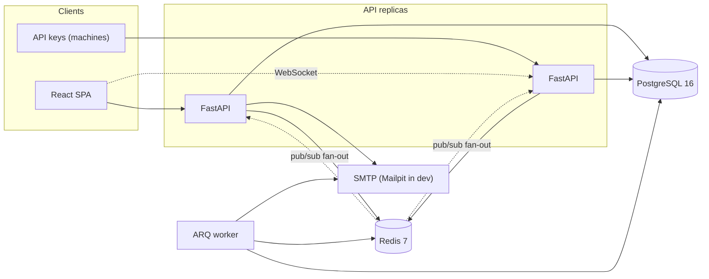

# Architecture

How incident-desk is put together and why. Decisions with a real trade-off are
recorded as ADRs in [docs/adr](adr/); this document is the map.

## The shape

The API is stateless: everything durable is in Postgres, everything ephemeral
(rate-limit windows, WebSocket fan-out, presence, job queue) is in Redis. That
is what lets the API run as N replicas behind a load balancer, and it is why
the WebSocket layer publishes through Redis rather than holding subscriptions
in process memory ([ADR-0006](adr/0006-redis-websocket-fanout.md)).

## Layers (backend)

The backend is layered so each concern is testable in isolation:

| Layer | Directory | Responsibility |
|---|---|---|
| API | `api/` | HTTP routing, request/response shaping, the auth and org-scoped authorisation dependencies |
| Schemas | `schemas/` | Pydantic request and response models; validation lives here |
| Services | `services/` | Business logic: sessions, MFA, incidents, comments, on-call, metrics, audit |
| Security | `security/` | Argon2 hashing, JWT, TOTP, opaque-token primitives |
| Data | `db/` | SQLAlchemy 2.0 models, engine plumbing, naming conventions |
| Jobs | `jobs/` | ARQ tasks: email, escalation, metrics rollup, retention |

The dependency direction is one-way: API depends on services depends on data.
Nothing in `db/` or `services/` imports from `api/`.

## Request lifecycle

1. `RequestIDMiddleware` assigns a traceable id, echoed in `X-Request-ID` and
   every error envelope.
2. `AccessLogMiddleware` emits one structured line per request, scrubbing
   token-bearing query parameters.
3. CORS is applied for the SPA's origin.
4. The rate-limit dependency checks a Redis sliding window keyed per user, per
   API key, or per IP depending on the route.
5. The org-scoped `require(...)` dependency resolves the organisation and the
   caller's standing in one query, applying the tenant boundary at the query
   level ([ADR-0001](adr/0001-tenant-isolation-404.md)).
6. The handler calls a service; the service owns the transaction.
7. Errors leave through one envelope with a stable machine code and the
   request id.

## Key mechanisms

- **Tenant isolation** is enforced in the query, not filtered afterwards, and
  cross-tenant reads answer 404 not 403 ([ADR-0001](adr/0001-tenant-isolation-404.md)).
- **Gapless per-org incident numbers** come from a `SELECT ... FOR UPDATE`
  counter row ([ADR-0004](adr/0004-gapless-sequence.md)).
- **Rotating refresh-token families** detect token theft
  ([ADR-0002](adr/0002-refresh-token-families.md)).
- **Cursor (keyset) pagination** keeps lists stable under concurrent writes
  ([ADR-0003](adr/0003-cursor-pagination.md)).
- **Overlapping on-call shifts** are impossible at the database level via an
  exclusion constraint ([ADR-0005](adr/0005-oncall-exclusion-constraint.md)).
- **WebSocket auth** uses single-use Redis tickets so long-lived JWTs never
  enter a URL ([ADR-0006](adr/0006-redis-websocket-fanout.md)).

## Frontend

React 19 + TypeScript (strict, no `any`). Server state is TanStack Query with
query-key factories and per-resource `staleTime`; the little genuinely-client
state (theme, active org, toasts) is Zustand. WebSocket events invalidate
precise query keys, never a blanket refetch, and on reconnect the client
refetches to reconcile missed events. The permission matrix is mirrored on the
client to gate controls, but the server is always the real boundary.

## Testing strategy

- Backend unit tests for pure logic (permission matrix, state machine).
- Backend integration tests against real Postgres with transaction-per-test
  rollback; the named high-value tests (tenant isolation over the route table,
  refresh-token reuse, 50-way concurrent sequence, on-call exclusion, ETag
  409, idempotency replay, cross-instance WebSocket delivery, job
  dead-lettering) each prove one guarantee.
- Frontend vitest for the client, stores, and helpers.
- Playwright E2E against the built compose images, including an axe
  accessibility scan that fails on any violation.
- CI additionally runs migration up/down/up, autogenerate-no-diff, and OpenAPI
  drift checks.
